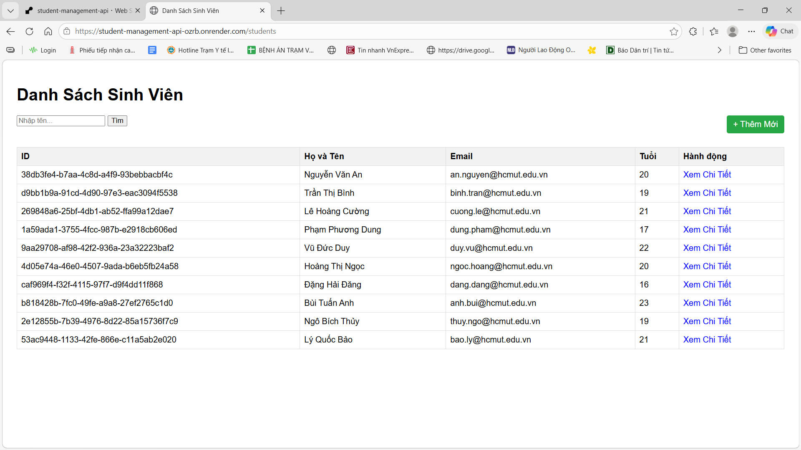
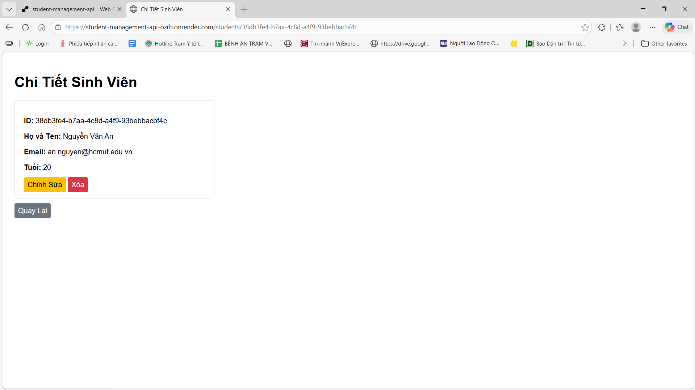
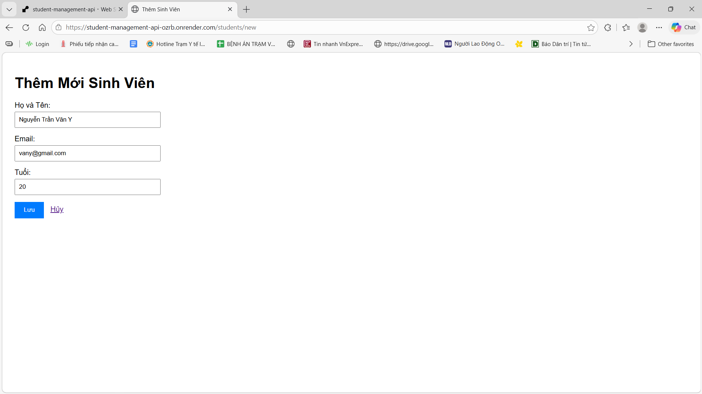
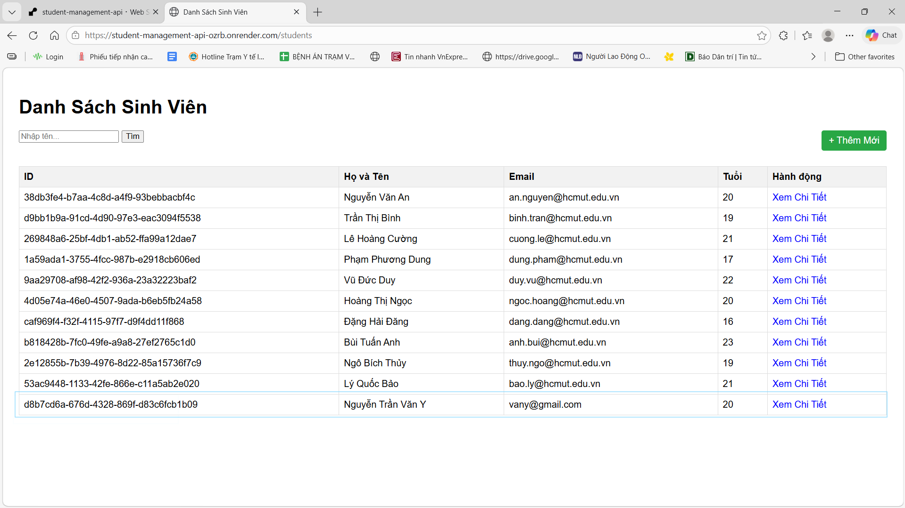
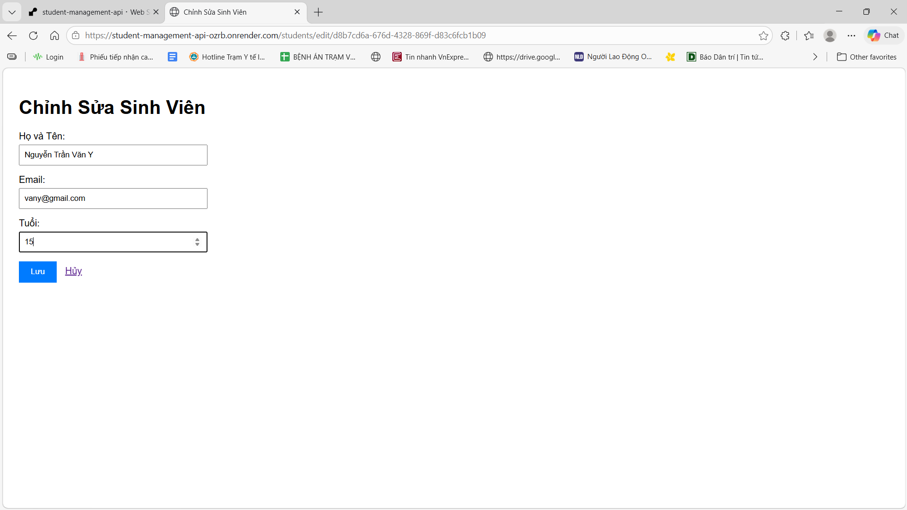
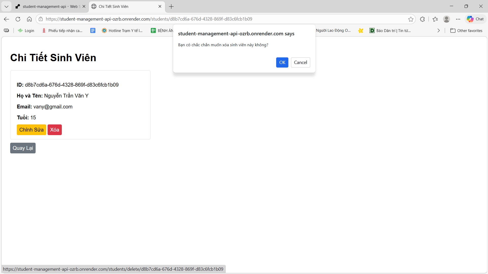
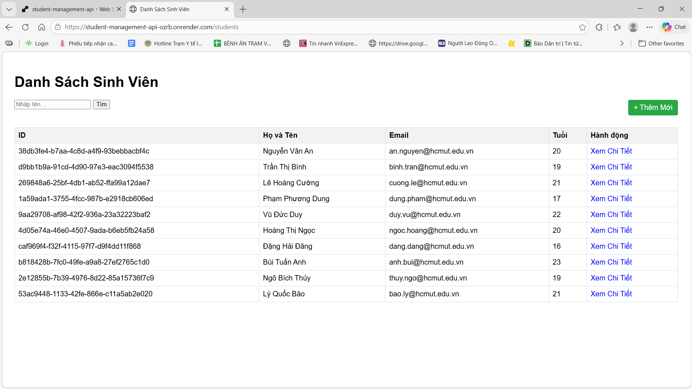

# Student Management – Advanced Software Engineering Lab

## 1. Giới thiệu bài thực hành
**Student Management** là bài thực hành (Lab) nhằm mục đích giúp các Sinh viên nắm kiến thức cơ bản để xây dựng một Webapp bằng Java Spring Boot

## 2. Thông tin thành viên trong nhóm thực hiện

| Họ và tên        | MSSV       | Mã lớp |
|------------------|------------|--------|
| Nguyễn Nhật Huy  | 2311197   | L01 |
| Thân Thiên Kim    | 2311795   | L02 |

---

## 2. Public URL của Web Service: https://student-management-api-ozrb.onrender.com/students

---

## 3. Hướng dẫn cách chạy dự án
1. Yêu cầu hệ thống
- Java Development Kit (JDK) phiên bản 21.
- PostgreSQL đã được cài đặt và đang chạy trên máy (hoặc dùng Docker).
- Git

2. Thiết lập Cơ sở dữ liệu
- Mở pgAdmin hoặc công cụ quản lý PostgreSQL.
- Tạo một Database trống có tên là student_management.

3. Cấu hình Biến Môi Trường (.env)
- Tạo một file có tên .env tại thư mục gốc của dự án (ngang hàng với pom.xml) với nội dung sau và thay đổi POSTGRES_PASSWORD cho khớp với máy của bạn:
- Đoạn mã:
```env
    POSTGRES_HOST=localhost
    POSTGRES_PORT=5432
    POSTGRES_DB=student_management
    POSTGRES_USER=postgres
    POSTGRES_PASSWORD=mat_khau_cua_ban
    SPRING_DATASOURCE_URL=jdbc:postgresql://${POSTGRES_HOST}:${POSTGRES_PORT}/${POSTGRES_DB}
    SPRING_DATASOURCE_USERNAME=${POSTGRES_USER}
    SPRING_DATASOURCE_PASSWORD=${POSTGRES_PASSWORD}
```

4. Chạy Ứng Dụng
Mở Terminal/Command Prompt tại thư mục dự án và chạy lệnh sau để Maven tự động tải thư viện và khởi động Spring Boot:

Trên Windows: mvnw spring-boot:run

Trên macOS/Linux: ./mvnw spring-boot:run

Sau khi ứng dụng báo Started, mở trình duyệt và truy cập: http://localhost:8080/students 

**Hướng Dẫn Triển Khai (Deployment)**
Dự án này đã được đóng gói sẵn Dockerfile để có thể dễ dàng triển khai lên nền tảng Render.com.

1. Cấu hình Database trên Cloud
- Đăng ký tài khoản trên Neon.tech và tạo project mới để lấy chuỗi kết nối (Connection String).
- Đảm bảo chuỗi kết nối bắt đầu bằng `jdbc:postgresql://....`

2. Triển khai lên Render.com
- Push toàn bộ mã nguồn (bao gồm Dockerfile) lên GitHub.
- Tạo New Web Service trên Render.com và kết nối với repository.
- Chọn Runtime: Docker và Instance Type: Free.
- Thêm các biến môi trường (Environment Variables) sau trên giao diện Render:
```
    DATABASE_URL: (Chuỗi kết nối JDBC từ Neon.tech của bạn)
    DB_USERNAME: (Tên đăng nhập Neon DB) 
    DB_PASSWORD: (Mật khẩu Neon DB)
```

- Nhấn Create Web Service và chờ Render tự động build. Khi thành công, bạn có thể truy cập ứng dụng qua link public onrender.com.

---

## 4. Trả lời câu hỏi các bài Lab

Lab 1 – Câu hỏi và trả lời

### Câu 1: Dữ liệu lớn  
**Hãy thử thêm ít nhất 10 sinh viên nữa.**

**Trả lời:**  
Đã thực hiện thêm 10 sinh viên vào bảng `students` bằng câu lệnh `INSERT INTO`.  
Việc thêm nhiều bản ghi giúp mô phỏng dữ liệu thực tế và thuận tiện cho việc kiểm tra truy vấn, hiển thị danh sách sinh viên và xử lý dữ liệu trong ứng dụng Java.

---

### Câu 2: Ràng buộc Khóa Chính (Primary Key)  
**Cố tình Insert một sinh viên có `id` trùng với một người đã có sẵn.  
Quan sát thông báo lỗi: `UNIQUE constraint failed`.  
Tại sao Database lại chặn thao tác này?**

**Trả lời:**  
Cột `id` được khai báo là **PRIMARY KEY**, nên nó phải **duy nhất (UNIQUE)** cho mỗi bản ghi trong bảng.  
Khi cố tình insert một sinh viên có `id` trùng với `id` đã tồn tại, Database sẽ phát hiện vi phạm ràng buộc và chặn thao tác này, đồng thời trả về lỗi:
`UNIQUE constraint failed: students.id`
Cơ chế này giúp:
- Đảm bảo mỗi sinh viên được định danh duy nhất
- Tránh trùng lặp dữ liệu
- Bảo vệ tính toàn vẹn của Database

---

### Câu 3: Toàn vẹn dữ liệu (Constraints)  
**Thử Insert một sinh viên nhưng bỏ trống cột `name` (để NULL).  
Database có báo lỗi không?  
Từ đó suy nghĩ xem sự thiếu chặt chẽ này ảnh hưởng gì khi code Java đọc dữ liệu lên?**

**Trả lời:**  
Trong trường hợp cột `name` **không được khai báo** `NOT NULL`, Database **không báo lỗi** khi insert dữ liệu với `name = NULL`.

Điều này có thể gây ra các vấn đề khi code Java đọc dữ liệu:
- Dễ xảy ra lỗi `NullPointerException` khi xử lý chuỗi
- Giao diện hiển thị bị thiếu thông tin (tên sinh viên trống)
- Logic nghiệp vụ bị sai lệch (ví dụ: tìm kiếm, sắp xếp theo tên)

Vì vậy, trong thực tế cần:
- Khai báo ràng buộc `NOT NULL` cho các cột quan trọng như `name`, `email`
- Hoặc kiểm tra dữ liệu chặt chẽ ở tầng ứng dụng (Java) trước khi insert vào Database

---

### Câu 4: Cấu hình Hibernate
**Tại sao mỗi lần tắt ứng dụng và chạy lại, dữ liệu cũ trong Database lại bị mất hết?

**Trả lời:**  
- Hiện tượng dữ liệu cũ trong Database lại bị mất hết xảy ra là do một dòng cấu hình của Hibernate trong file application.properties (hoặc application.yml). Cụ thể là thuộc tính:
`spring.jpa.hibernate.ddl-auto`

- Thuộc tính này quyết định cách Hibernate can thiệp vào cấu trúc bảng (Table) trong Database mỗi khi ứng dụng khởi động. Dữ liệu của bạn bị mất vì thuộc tính này đang được đặt ở giá trị `create`
Cách hoạt động: Mỗi lần bạn ấn chạy ứng dụng (Run), Hibernate sẽ gửi lệnh xóa (DROP) toàn bộ các bảng hiện có trong Database, sau đó tạo lại (CREATE) các bảng mới tinh (dựa trên các class @Entity của bạn).

- Hậu quả: Bảng cũ bị xóa đi đồng nghĩa với việc toàn bộ dữ liệu 

- Để giữ lại dữ liệu cũ sau mỗi lần khởi động lại bạn cần đổi giá trị đó thành `update` hoặc `none`:

- `update` (Khuyên dùng khi làm Lab/Đang phát triển): Khi ứng dụng chạy, Hibernate sẽ kiểm tra xem bảng đã có chưa. Nếu chưa có thì nó tạo. Nếu có rồi, nó sẽ giữ nguyên dữ liệu bên trong. Nó chỉ thêm cột mới nếu bạn thêm biến mới vào file Student.java.

- Cú pháp: `spring.jpa.hibernate.ddl-auto=update`

- `none` hoặc `validate`: Hibernate sẽ hoàn toàn không tự động tạo hay sửa bảng gì cả. Nó mặc định Database đã được ai đó tạo sẵn bằng tay hoặc bằng tool khác rồi. Nó chỉ kiểm tra xem code Java có khớp với Database không thôi.

---

## 5. Screenshot cho các module trong Lab 4.
Module 1: Trang Danh Sách (List View)

Module 2:  Trang Chi Tiết (Detail View)

Module 3: Chức Năng Thêm & Sửa
- Thêm:


- Sửa:


- Xóa: 



